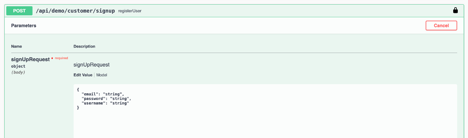
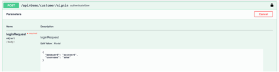
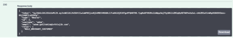
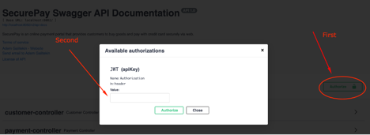
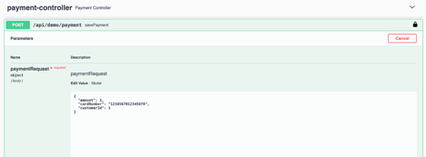
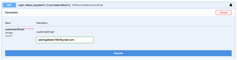
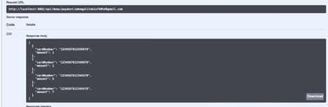
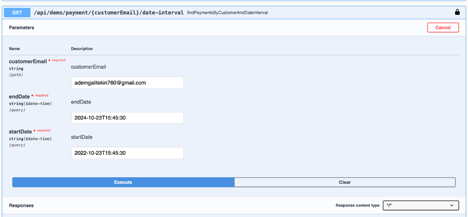
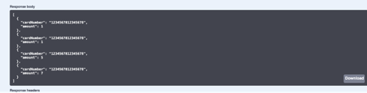
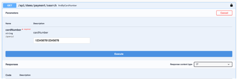

# SecurePay

### What is SecurePay?

SecurePay is an online payment portal that provides customers to buy goods and pay with credit card securely via web. Design by Firisbe and Created by Adem Galitekin. With this project we aim to create a system that have customers and they can make payments. 

### Requirements

- New customers must be registered to the system.
- New payments must be added to the system and they must be associated with a customer.
- One customer can have many payments, however a payment cannot have many customers. So, there is a One-Many Association from customer to payment.
- All payments of customer should be list.
- Payments should be list by some filter such as card number, or customer email.
- All payments should be list by date interval.

### Project Structure

In this project I preferred to use Spring Security for authentication and authorization concepts. According to this, users (customers) must register to the system in order to make payments and etc.
The register process is controlled by a AuthService where customers type their username, email and password. If there is any other account with the same email or username the program returns with 400 response which says that it’s bad request. When users register with the valid credentials password is encoded and the other data saved to the mysql database.

After registering successfully, then users can login with their credentials. After that, an access token returns and the user should set that token with the “Bearer “ prefix to the swagger ui, so they can access the secured endpoint in that case. 

### Project Images

These are some project flow images to understand better. 

1. Customers need to register with valid credentials.

2. After signing-up successfully then customers should sign-in

3.	After signing-in successfully, user will get an access token

4.	Customers should set Authorization header value with the access token.

5.	And then they can make payments with PaymentController’s post method.

After the right values payment will save to the database. The important thing is that amount 

- Must be greater than ”0”
- Customer id must belong to valid and existing customer
- Card number must be 16 digits and contains only numbers
- And entered card number must not use by different customer

if any of them happens the system return with http code: 400 and logs the everything to the console.

6.	Customers also can find all payments with customer email

7.	And the result will be something like this

8.	Customers can also get payments within an interval. The important thing is here that date format must be yyyy-MM-dd'T'HH:mm:ss

9.	The response will be something like this

10.	And lastly customers can search payments with credit card numbers.

11.	And the result will be something like this

### Tech Stack

These are the tech stack that I've used for this project.

- Spring Boot
- Spring Security (For authentication)
- io.jsonwebtoken (For jwt tokens)
- Mysql Database (I could use No SQL Databases such as mongodb because I haven't used any transactinal case but for the future development this was best for me)
- Mysql Connector (Connection driver)
- Springfox (For Swagger)
- Spring Boot Starter Validation (For Validation)
- Spring Jpa (For database operations)
- Lombok (For clean code)
- Map Struct (For mapper)
- Mockito (For testing)

### In the Project Beginning

In the project beginning I started with the api design. I've created URIs for reusable and maintainable code. Also made some use case diagrams to gather requirements. Also created the ER Diagrams for Customer, Payment and Role Models. First I created Customer entity and Auth Service, when the authentication structure is finished, I started to write the business logic.   